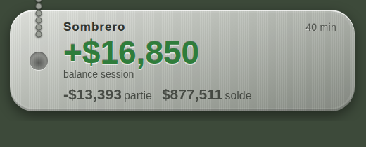

# dogtag - stats de session pour WARDOGS

dogtag lit le HUD de WARDOGS à l'écran, compte tes kills, downs, assists, revives et ton argent,
les affiche en direct sur ton stream, trace ton solde dans Grafana et envoie chaque session où tu
veux (ton serveur, un salon Discord).


## Les zips

| Zip | Pour qui | Contenu |
|---|---|---|
| `dogtag-windows.zip` | ton PC de jeu | `dogtag.exe` prêt à lancer, scripts `.bat`, config d'exemple, Grafana local |
| `dogtag-server.zip` | un serveur distant (VPS, Raspberry Pi) | Grafana + stockage + classement derrière HTTPS, à lancer avec Docker |
| `dogtag-sources.zip` | pour modifier ou recompiler | tout le code Rust, les tests, le tableau de bord Grafana |

## Démarrage rapide (Windows)

1. Dézippe `dogtag-windows.zip` où tu veux.
2. Double-clique sur **`1-telecharger-modeles.bat`** (modèles OCR, ~12 Mo, une seule fois).
3. Double-clique sur **`2-lancer-dogtag.bat`**. Au premier lancement il crée `config.toml` à partir
   de `config.example.toml` : ferme-le, mets ton pseudo à la ligne `player`, relance.
4. Mets WARDOGS **en anglais** (les récompenses sont reconnues en anglais) et joue.
5. Dans OBS : **Source navigateur**, URL `http://127.0.0.1:47900/`, taille **520 × 210**.
6. **Ctrl+C** dans la fenêtre dogtag termine la session : elle est enregistrée et envoyée.

Windows affiche un avertissement SmartScreen (exe non signé) : *Informations complémentaires*,
*Exécuter quand même*. L'empreinte SHA256 est dans `dogtag.exe.sha256`.

Pour mettre à jour : remplace `dogtag.exe` (ton `config.toml` n'est jamais dans les zips, il n'est
pas écrasé), puis dans OBS, propriétés de la source navigateur, **Actualiser le cache de la page**.

## Deux modes

| Mode | Lancement | Ce qui est suivi |
|---|---|---|
| **full** | `2-lancer-dogtag.bat` | tout : récompenses (kills, assists...), downs, K/D, argent |
| **money** | `4-lancer-mode-argent.bat` | seulement ton **argent total** et sa variation (solde, balance session, partie) |

Tu peux aussi le fixer dans `config.toml` (`mode = "money"`) ou en ligne de commande
(`dogtag.exe --mode money`). En mode money, l'overlay n'affiche que l'argent, la carte Discord aussi,
et Grafana reçoit les mêmes courbes d'argent.



## Ce que dogtag suit

**Lignes de récompense du HUD** (en haut à droite) :

| Stat | Lignes comptées |
|---|---|
| Kills | `KILL`, `REVENGE KILL` |
| Headshots | `HEADSHOT` |
| Assists | `ASSIST`, `SUPPLIED PLAYER ASSIST` |
| Revives | `REVIVED TEAMMATE` |
| Véhicules | `VEHICLE DESTROYED`, `ROTORS DESTROYED` |
| Objectifs | `CONTROL ZONE ...`, `HOT ZONE ...` |
| XP, argent gagné / dépensé | les montants de ces lignes |

**Les cases d'argent** (en haut à droite, `-$13,393` puis `$877,511`) :
- **Solde** : ta money globale (la case contre le bord).
- **Balance session** : solde actuel moins solde au lancement de dogtag.
- **Partie** : la variation de la partie, recopiée du jeu (la case avec la flèche).

**Downs** : quand « VIEW DAMAGE LOG » apparaît. **K/D** = kills / downs.

### Protections contre les sauts bizarres

Le solde passe par plusieurs filtres, dans les deux modes :

1. **Stable avant d'être cru** : un nouveau solde doit être lu identique 3 fois de suite pendant
   au moins 0,9 s (le compteur du jeu défile par des valeurs intermédiaires).
2. **Seulement le HUD normal** : le premier solde et tout gros changement (plus de 20 000 $) ne sont
   crus que s'ils viennent du HUD en jeu (variation de partie + solde contre le bord droit). Les écrans
   de mort, de fin de partie, l'inventaire ou la carte ne peuvent jamais les imposer.
3. **Jamais 2 chiffres d'un coup** : un solde qui gagne ou perd 2 chiffres (879 244 -> 896 749 872)
   est toujours refusé (deux nombres collés).
4. **Pas lu à terre** : à terre, et 45 s après (carte, inventaire), le solde et la partie sont en pause.
5. **Pas de saut dans la balance session** : si un gros changement reste affiché sur le HUD normal
   plus d'une minute, dogtag le prend comme solde mais **recale** le début de session dessus : la
   balance session ne saute pas. L'événement est noté (`BALANCE REBASE`) dans le fichier de session.

Un test simule 2 heures de jeu avec toutes les erreurs de lecture vues jusqu'ici (chiffre perdu, chiffre
mal lu, `143` collé, écran de fin de partie affiché 5 min, `$200` de la carte, compteur qui défile) :
aucune valeur qui n'a jamais été ton solde n'est acceptée. Il échoue si on retire l'un des filtres.

Pour les récompenses (mode full) : une ligne ne compte qu'une fois même si elle reste à l'écran, et
ouvrir la carte ou l'inventaire pendant ta mort ne crée pas de deuxième down.

## Où vont les stats

| Destination | Quoi | Réglage (`config.toml`) |
|---|---|---|
| Overlay OBS | direct | `[overlay]` |
| `data/sessions/*.json` | chaque session complète, avec tous les événements | toujours |
| `data/balance.csv` | chaque changement de solde, kills, downs | `[metrics] csv` |
| Grafana | courbes au fil du temps | `[metrics] url` |
| Ton serveur / `serve-stats` | chaque session + classement | `[push] endpoint` |
| Discord | carte récap en fin de session | `[push] discord_webhook` |

Un envoi raté est retenté au prochain lancement. Les sessions de moins de 5 min restent en local
(`[push] min_minutes`).

## Grafana

### Sur ton PC

Avec Docker Desktop, dans le dossier `grafana/` : `docker compose up -d`, puis dans `config.toml` :

```toml
[metrics]
url = "http://localhost:8428/write"
```

Grafana : http://localhost:3000 (admin / `wardogs`). Le tableau de bord **WARDOGS - dogtag** est
déjà prêt.

### Sur un serveur distant

Avec `dogtag-server.zip`, sur un serveur avec Docker, les ports 80/443 ouverts et un nom de domaine
qui pointe vers lui (un sous-domaine DuckDNS gratuit suffit) :

```sh
cd dogtag/server
cp .env.example .env        # DOMAIN, DOGTAG_TOKEN, GRAFANA_PASSWORD, GRAFANA_PUBLIC
docker compose up -d --build
```

Sur ton PC, avec le même jeton que `DOGTAG_TOKEN` :

```toml
[metrics]
url = "https://stats.tondomaine.fr/write"
token = "le-jeton"

[push]
endpoint = "https://stats.tondomaine.fr/api/sessions"
token = "le-jeton"
```

- `https://stats.tondomaine.fr/` : Grafana (`admin` + ton mot de passe ; `GRAFANA_PUBLIC=true` pour
  le rendre visible sans compte)
- `https://stats.tondomaine.fr/api/leaderboard` : classement de tous les joueurs qui envoient
- Sans le bon jeton, rien ne s'écrit (401). Le stockage n'est jamais exposé directement.

Toute ton escouade peut envoyer sur le même serveur : chacun met son pseudo et le jeton.

### Les séries

Étiquette `player` sur toutes : `wardogs_balance` (solde), `wardogs_balance_delta` (balance
session), `wardogs_match_change` (partie), `wardogs_money_earned`, `wardogs_money_spent`,
`wardogs_kills`, `wardogs_downs`, `wardogs_kd`, `wardogs_assists`, `wardogs_revives`,
`wardogs_vehicles`, `wardogs_headshots`, `wardogs_xp`, `wardogs_downed`.

Variation de ton solde par heure : `wardogs_balance - wardogs_balance offset 1h` (`1d` par jour).

## Discord

Paramètres du salon, *Intégrations*, *Webhooks*, *Nouveau webhook*, copie l'URL :

```toml
[push]
discord_webhook = "https://discord.com/api/webhooks/..."
```

## Réglages et dépannage

**Mode debug** : `3-lancer-en-mode-debug.bat` (ou `dogtag.exe --debug`) affiche tout ce que l'OCR lit (`[ocr] ...`), chaque
solde retenu (`[solde]`), chaque partie (`[partie]`), chaque montant refusé (`[solde ignoré]`), les recalages (`[solde] ... se recale`) et les
downs (`[+] DOWNED`, `[=] même down`).

**Calibrer** sur une capture d'écran de ta partie :

```
dogtag.exe calibrate capture.png
```

Ça enregistre `calibrate/cash.png` et `calibrate/downed.png` (exactement ce que l'OCR reçoit) et
affiche chaque ligne lue avec son interprétation. Les zones sont en fractions de la hauteur de l'image,
ancrées au bord droit : elles marchent en 1080p, 1440p, 4K et ultrawide.

| Problème | Réglage |
|---|---|
| Rien n'est lu | vérifie `calibrate/cash.png` ; `[regions.cash]` |
| Texte mal lu | `[ocr] scale` (2 à 3), `threshold` (ex. 170) |
| Downs jamais détectés | `calibrate/downed.png` doit contenir « VIEW DAMAGE LOG » ; `[regions.downed]` |
| Downs rapprochés comptés comme un seul | baisse `[balance] same_down_within_s` |
| Un vrai gros gain met du temps à apparaître | `[balance] max_jump`, `big_jump_hold_s` (il est recalé, pas compté) |
| Le jeu est dans une autre fenêtre | `[capture] window_title` (ou vide + `monitor`) |

Autres commandes : `dogtag.exe replay dossier/` rejoue un dossier de captures (tests sans jouer),
`POST http://127.0.0.1:47900/api/end` termine la session (bouton Stream Deck), `GET /api/session`
donne l'état en JSON, `/metrics` au format Prometheus.

## Limites

- Pas encore lus : le **killfeed** (victimes, arme, plus long kill) et la différence down / mort.
- Pendant que la carte ou l'inventaire cachent les lignes de récompense, un assist ne peut pas être lu.
- Une ligne de récompense identique qui apparaît pile quand l'ancienne disparaît peut être ratée.
- La capture live marche sous Windows uniquement (`replay` et `calibrate` partout).

## Anti-cheat

dogtag lit seulement des pixels via les API de capture de Windows, comme OBS : pas de lecture
mémoire, pas d'injection, rien envoyé au jeu. Ce n'est validé par personne officiellement :
demande aux développeurs (BULKHEAD) avant de le distribuer largement.

## Compiler depuis les sources

```sh
cargo test
cargo build --release          # sur Windows : target/release/dogtag.exe
```

`.github/workflows/windows.yml` compile l'exe à chaque push sur GitHub (onglet Actions). Les
modèles OCR vont dans `models/` (voir `1-telecharger-modeles.bat`).
