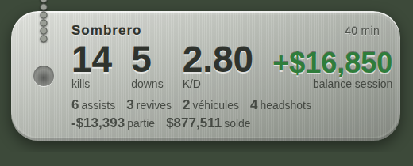

# dogtag - solde + niveau pour WARDOGS

dogtag lit le HUD de WARDOGS à l'écran et suit deux choses, rien d'autre : ton **solde total** et ton
**niveau/rang**. Il les affiche en direct sur ton stream, trace ton solde dans Grafana et envoie
chaque session où tu veux (ton serveur, un salon Discord).



## Les zips

| Zip | Pour qui | Contenu |
|---|---|---|
| `dogtag-windows.zip` | ton PC de jeu | `dogtag.exe` prêt à lancer, scripts `.bat`, config d'exemple, Grafana local |
| `dogtag-server.zip` | un serveur distant (VPS, Raspberry Pi) | Grafana + stockage + classement derrière HTTPS, à lancer avec Docker |
| `dogtag-sources.zip` | pour modifier ou recompiler | tout le code Rust, les tests, le tableau de bord Grafana |

## Démarrage rapide (Windows)

1. Dézippe `dogtag-windows.zip` où tu veux.
2. Double-clique sur **`1-telecharger-modeles.bat`** (modèles OCR, ~12 Mo, une seule fois).
3. Double-clique sur **`2-lancer-dogtag.bat`**. Au premier lancement il crée `config.toml` à partir
   de `config.example.toml` : ferme-le, mets ton pseudo à la ligne `player`, relance.
4. Mets WARDOGS **en anglais** et joue.
5. Dans OBS : **Source navigateur**, URL `http://127.0.0.1:47900/`, taille **520 × 140**.
6. **Ctrl+C** dans la fenêtre dogtag termine la session : elle est enregistrée et envoyée.

Windows affiche un avertissement SmartScreen (exe non signé) : *Informations complémentaires*,
*Exécuter quand même*. L'empreinte SHA256 est dans `dogtag.exe.sha256`.

Pour mettre à jour : remplace `dogtag.exe` (ton `config.toml` n'est jamais dans les zips, il n'est
pas écrasé), puis dans OBS, propriétés de la source navigateur, **Actualiser le cache de la page**.

## Ce que dogtag suit

**Le solde** (en haut à droite du HUD, la case contre le bord) : ton argent total dans le jeu,
affiché en direct sur l'overlay.

**Le niveau/rang** : un badge collé directement au solde sur l'écran de fin de manche
(`$967,270147` = solde `$967,270` + niveau `147`, sans séparateur - un artefact d'OCR, géré
automatiquement). Comme il n'apparaît que là, il ne se met à jour qu'en fin de partie.

C'est tout - pas de kills, downs, assists, XP ou variation de partie.

### Protections contre les sauts bizarres

Le solde passe par plusieurs filtres :

1. **Stable avant d'être cru** : un nouveau solde doit être lu identique 3 fois de suite pendant
   au moins 0,9 s (le compteur du jeu défile par des valeurs intermédiaires).
2. **Seulement le HUD normal** : le premier solde et tout gros changement (plus de 20 000 $) ne sont
   crus que s'ils viennent du HUD en jeu (variation de partie + solde contre le bord droit). Les écrans
   de mort, de fin de partie, l'inventaire ou la carte ne peuvent jamais les imposer.
3. **Jamais 2 chiffres d'un coup** : un solde qui gagne ou perd 2 chiffres (879 244 -> 896 749 872)
   est toujours refusé (deux nombres collés).
4. **Pas lu à terre** : à terre, et 45 s après (carte, inventaire), le solde est en pause.
5. **Pas de saut dans la balance session** : si un gros changement reste affiché sur le HUD normal
   plus d'une minute, dogtag le prend comme solde mais **recale** le début de session dessus : la
   balance session ne saute pas.

Un test simule 2 heures de jeu avec toutes les erreurs de lecture vues jusqu'ici (chiffre perdu, chiffre
mal lu, `143` collé, écran de fin de partie affiché 5 min, `$200` de la carte, compteur qui défile) :
aucune valeur qui n'a jamais été ton solde n'est acceptée. Il échoue si on retire l'un des filtres.

## Où vont les stats

| Destination | Quoi | Réglage (`config.toml`) |
|---|---|---|
| Overlay OBS | direct | `[overlay]` |
| `data/sessions/*.json` | chaque session (solde, niveau) | toujours |
| `data/balance.csv` | chaque changement de solde/niveau | `[metrics] csv` |
| Grafana | courbes au fil du temps | `[metrics] url` |
| Ton serveur / `serve-stats` | chaque session + classement | `[push] endpoint` |
| Discord | carte récap en fin de session | `[push] discord_webhook` |

Un envoi raté est retenté au prochain lancement. Les sessions de moins de 5 min restent en local
(`[push] min_minutes`).

## Grafana

### Sur ton PC

Avec Docker Desktop, dans le dossier `grafana/` : `docker compose up -d`, puis dans `config.toml` :

```toml
[metrics]
url = "http://localhost:8428/write"
```

Grafana : http://localhost:3000 (admin / `wardogs`). Le tableau de bord **WARDOGS - dogtag** est
déjà prêt.

### Sur un serveur distant

Avec `dogtag-server.zip`, sur un serveur avec Docker, les ports 80/443 ouverts et un nom de domaine
qui pointe vers lui (un sous-domaine DuckDNS gratuit suffit) :

```sh
cd dogtag/server
cp .env.example .env        # DOMAIN, DOGTAG_TOKEN, GRAFANA_PASSWORD, GRAFANA_PUBLIC
docker compose up -d --build
```

Sur ton PC, avec le même jeton que `DOGTAG_TOKEN` :

```toml
[metrics]
url = "https://stats.tondomaine.fr/write"
token = "le-jeton"

[push]
endpoint = "https://stats.tondomaine.fr/api/sessions"
token = "le-jeton"
```

- `https://stats.tondomaine.fr/` : Grafana (`admin` + ton mot de passe ; `GRAFANA_PUBLIC=true` pour
  le rendre visible sans compte)
- `https://stats.tondomaine.fr/api/leaderboard` : classement de tous les joueurs qui envoient
- Sans le bon jeton, rien ne s'écrit (401). Le stockage n'est jamais exposé directement.

Toute ton escouade peut envoyer sur le même serveur : chacun met son pseudo et le jeton.

### Les séries

Étiquette `player` sur toutes : `wardogs_balance` (solde), `wardogs_balance_delta` (balance
session), `wardogs_rank` (niveau/rang, en fin de manche).

Variation de ton solde par heure : `wardogs_balance - wardogs_balance offset 1h` (`1d` par jour).

## Discord

Paramètres du salon, *Intégrations*, *Webhooks*, *Nouveau webhook*, copie l'URL :

```toml
[push]
discord_webhook = "https://discord.com/api/webhooks/..."
```

## Réglages et dépannage

**Mode debug** : `3-lancer-en-mode-debug.bat` (ou `dogtag.exe --debug`) affiche tout ce que l'OCR lit
(`[ocr] ...`), chaque solde retenu (`[solde]`), chaque montant refusé (`[solde ignoré]`), les
recalages, et chaque niveau détecté (`[niveau] ...`).

**Calibrer** sur une capture d'écran de ta partie :

```
dogtag.exe calibrate capture.png
```

Ça enregistre `calibrate/cash.png` et `calibrate/downed.png` (exactement ce que l'OCR reçoit) et
affiche chaque ligne lue avec son interprétation (solde, partie, niveau). Les zones sont en fractions
de la hauteur de l'image, ancrées au bord droit : elles marchent en 1080p, 1440p, 4K et ultrawide.

| Problème | Réglage |
|---|---|
| Rien n'est lu | vérifie `calibrate/cash.png` ; `[regions.cash]` |
| Texte mal lu | `[ocr] scale` (2 à 3), `threshold` (ex. 170) |
| Niveau jamais détecté | il ne s'affiche qu'en fin de manche, collé au solde (ex. `$967,270147`) - vérifie `[ocr]` en debug à ce moment-là |
| Victoires/défaites jamais détectées | en debug, regarde `[ocr result]` pile quand la bannière VICTORY/DEFEAT est affichée : si c'est vide ou ne contient pas le mot, `[regions.result]` est mal calé pour ta résolution/UI - recalibre-le |
| Le solde se fige trop souvent | `calibrate/downed.png` doit contenir « VIEW DAMAGE LOG » quand tu es à terre ; `[regions.downed]` |
| Un vrai gros gain met du temps à apparaître | `[balance] max_jump`, `big_jump_hold_s` (il est recalé, pas compté) |
| Le jeu est dans une autre fenêtre | `[capture] window_title` (ou vide + `monitor`) |

Autres commandes : `dogtag.exe replay dossier/` rejoue un dossier de captures (tests sans jouer),
`POST http://127.0.0.1:47900/api/end` termine la session (bouton Stream Deck), `GET /api/session`
donne l'état en JSON, `/metrics` au format Prometheus.

### Expérimental : score des 3 équipes en fin de manche

`[regions.victory]` (désactivé par défaut, voir `config.example.toml`) lit les 3 scores d'équipe du
panneau de fin de manche. C'est encore en calibration (le panneau est centré à l'écran, pas collé à
un bord comme les autres zones) et n'est pas encore envoyé à Grafana/serve-stats - juste affiché en
`--debug` (`[victory] ...`) pour vérifier que la zone est bien calée.

## Limites

- La capture live marche sous Windows uniquement (`replay` et `calibrate` partout).
- Le niveau ne se met à jour qu'en fin de manche (c'est le seul écran où il est affiché).

## Anti-cheat

dogtag lit seulement des pixels via les API de capture de Windows, comme OBS : pas de lecture
mémoire, pas d'injection, rien envoyé au jeu. Ce n'est validé par personne officiellement :
demande aux développeurs (BULKHEAD) avant de le distribuer largement.

## Compiler depuis les sources

```sh
cargo test
cargo build --release          # sur Windows : target/release/dogtag.exe
```

`.github/workflows/windows.yml` compile l'exe à chaque push sur GitHub (onglet Actions). Les
modèles OCR vont dans `models/` (voir `1-telecharger-modeles.bat`).
